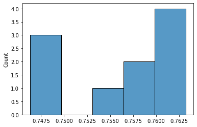
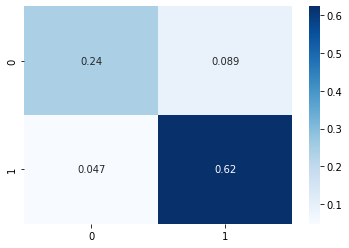

# **Modelo predictivo**

**Integrantes:**

**Juan David Julio San Juan**

**Camilo José Sinning López**


Este modelo tomará como entradas el nombre del departamento y la aprobación en eduación media de esta para predecir deserción alta o baja a travez de un modelo de regresión logistica.

## **Se carga la base de datos**


```python
import pandas as pd
```


```python
df = pd.read_csv('MEN_ESTADISTICAS_EN_EDUCACION_EN_PREESCOLAR__B_SICA_Y_MEDIA_POR_MUNICIPIO.csv')
```


```python
df.info()
```

    <class 'pandas.core.frame.DataFrame'>
    RangeIndex: 11219 entries, 0 to 11218
    Data columns (total 41 columns):
     #   Column                       Non-Null Count  Dtype  
    ---  ------                       --------------  -----  
     0   AÑO                          11219 non-null  int64  
     1   CÓDIGO_MUNICIPIO             11219 non-null  int64  
     2   MUNICIPIO                    11219 non-null  object 
     3   CÓDIGO_DEPARTAMENTO          11219 non-null  int64  
     4   DEPARTAMENTO                 11219 non-null  object 
     5   CÓDIGO_ETC                   11219 non-null  int64  
     6   ETC                          11219 non-null  object 
     7   POBLACIÓN_5_16               11213 non-null  float64
     8   TASA_MATRICULACIÓN_5_16      11104 non-null  float64
     9   COBERTURA_NETA               11108 non-null  float64
     10  COBERTURA_NETA_TRANSICIÓN    11167 non-null  float64
     11  COBERTURA_NETA_PRIMARIA      11128 non-null  float64
     12  COBERTURA_NETA_SECUNDARIA    11125 non-null  float64
     13  COBERTURA_NETA_MEDIA         11126 non-null  float64
     14  COBERTURA_BRUTA              11151 non-null  float64
     15  COBERTURA_BRUTA_TRANSICIÓN   11122 non-null  float64
     16  COBERTURA_BRUTA_PRIMARIA     11138 non-null  float64
     17  COBERTURA_BRUTA_SECUNDARIA   11131 non-null  float64
     18  COBERTURA_BRUTA_MEDIA        11092 non-null  float64
     19  TAMAÑO_PROMEDIO_DE_GRUPO     7572 non-null   float64
     20  SEDES_CONECTADAS_A_INTERNET  7768 non-null   float64
     21  DESERCIÓN                    11077 non-null  float64
     22  DESERCIÓN_TRANSICIÓN         10316 non-null  float64
     23  DESERCIÓN_PRIMARIA           10977 non-null  float64
     24  DESERCIÓN_SECUNDARIA         10949 non-null  float64
     25  DESERCIÓN_MEDIA              10485 non-null  float64
     26  APROBACIÓN                   11194 non-null  float64
     27  APROBACIÓN_TRANSICIÓN        11194 non-null  float64
     28  APROBACIÓN_PRIMARIA          11194 non-null  float64
     29  APROBACIÓN_SECUNDARIA        11165 non-null  float64
     30  APROBACIÓN_MEDIA             11118 non-null  float64
     31  REPROBACIÓN                  11133 non-null  float64
     32  REPROBACIÓN_TRANSICIÓN       11126 non-null  float64
     33  REPROBACIÓN_PRIMARIA         11122 non-null  float64
     34  REPROBACIÓN_SECUNDARIA       11113 non-null  float64
     35  REPROBACIÓN_MEDIA            11074 non-null  float64
     36  REPITENCIA                   11076 non-null  float64
     37  REPITENCIA_TRANSICIÓN        11060 non-null  float64
     38  REPITENCIA_PRIMARIA          11071 non-null  float64
     39  REPITENCIA_SECUNDARIA        11067 non-null  float64
     40  REPITENCIA_MEDIA             11080 non-null  float64
    dtypes: float64(34), int64(4), object(3)
    memory usage: 3.5+ MB
    


```python
df.columns
```


    Index(['AÑO', 'CÓDIGO_MUNICIPIO', 'MUNICIPIO', 'CÓDIGO_DEPARTAMENTO',
           'DEPARTAMENTO', 'CÓDIGO_ETC', 'ETC', 'POBLACIÓN_5_16',
           'TASA_MATRICULACIÓN_5_16', 'COBERTURA_NETA',
           'COBERTURA_NETA_TRANSICIÓN', 'COBERTURA_NETA_PRIMARIA',
           'COBERTURA_NETA_SECUNDARIA', 'COBERTURA_NETA_MEDIA', 'COBERTURA_BRUTA',
           'COBERTURA_BRUTA_TRANSICIÓN', 'COBERTURA_BRUTA_PRIMARIA',
           'COBERTURA_BRUTA_SECUNDARIA', 'COBERTURA_BRUTA_MEDIA',
           'TAMAÑO_PROMEDIO_DE_GRUPO', 'SEDES_CONECTADAS_A_INTERNET', 'DESERCIÓN',
           'DESERCIÓN_TRANSICIÓN', 'DESERCIÓN_PRIMARIA', 'DESERCIÓN_SECUNDARIA',
           'DESERCIÓN_MEDIA', 'APROBACIÓN', 'APROBACIÓN_TRANSICIÓN',
           'APROBACIÓN_PRIMARIA', 'APROBACIÓN_SECUNDARIA', 'APROBACIÓN_MEDIA',
           'REPROBACIÓN', 'REPROBACIÓN_TRANSICIÓN', 'REPROBACIÓN_PRIMARIA',
           'REPROBACIÓN_SECUNDARIA', 'REPROBACIÓN_MEDIA', 'REPITENCIA',
           'REPITENCIA_TRANSICIÓN', 'REPITENCIA_PRIMARIA', 'REPITENCIA_SECUNDARIA',
           'REPITENCIA_MEDIA'],
          dtype='object')


## **Se filtran las columnas que no son de interes**


```python
cols = ['DEPARTAMENTO','DESERCIÓN_MEDIA','APROBACIÓN_MEDIA'];
df_model = df[cols]
```

Se remueven las filas que tienen algun campo NaN


```python
df_model = df_model.dropna()
```

Se cambia la columna categorica 'DEPARTAMENTO' por dummies 


```python
dept = pd.get_dummies(df_model.DEPARTAMENTO, prefix='DEPARTAMENTO')
dept.head()
df_model = df_model.join(dept)
df_model.drop(['DEPARTAMENTO'], axis=1, inplace=True)
```

Se crea una nueva columna que contendrá lo que consideramos Deserción alta o baja dependiento de el porcentaje que cada fila muestra en 'DESERCIÓN_MEDIA'.

Nota: Se usa 4 para determinar si más de eso es deserción alta y menos de eso es deserción baja.


```python
df_model['DESERCIÓN_MEDIA_CAT'] = df_model['DESERCIÓN_MEDIA'].map(lambda x: 1 if x>=4 else 0)
df_model = df_model.drop(['DESERCIÓN_MEDIA'], axis = 1)
```

## **Se crea el modelo**

Se definen las variables de entrada y salida


```python
X = df_model.drop(['DESERCIÓN_MEDIA_CAT'], axis = 1);
y = df_model.DESERCIÓN_MEDIA_CAT.copy();
```

Se hace la separación de datos para entrenamiento y datos para validación


```python
from sklearn.model_selection import train_test_split
X_train, X_val, y_train, y_val = train_test_split(X, y, test_size=0.3)
```


```python
from sklearn.linear_model import LogisticRegression
```

Se entrena y prueba el modelo

Nota: se aumentan las iteraciones por recomendación de la libreria sklearn


```python
model = LogisticRegression(max_iter=1000)
log_mod = model.fit(X_train, y_train)
log_mod.score(X_val, y_val)
```


    0.7463399108847868


Hacemos 1000 veces el modelo para determinar el score promedio y a varianza.


```python
succ = [];
for i in range(10):
  X_train, X_val, y_train, y_val = train_test_split(X, y, test_size=0.3)
  log_mod = LogisticRegression(max_iter=1000).fit(X_train, y_train);
  succ.append(log_mod.score(X_val, y_val));

```


```python
import seaborn as sns
import numpy as np
sns.histplot(succ)
succ = np.array(succ);
```


    

    


```python
np.mean(succ)
```


    0.7559516231699555


```python
np.var(succ)
```


    3.3504305641600106e-05


# **Comprobar hipotesis**

Los municipios mas rurales presentan una mayor tasa de deserción.


```python
import pandas as pd
import numpy as np
```


```python
df = pd.read_csv('MEN_ESTADISTICAS_EN_EDUCACION_EN_PREESCOLAR__B_SICA_Y_MEDIA_POR_MUNICIPIO.csv')
```


```python
# log_mod.predict_proba(X)
```


```python
cols = ['DEPARTAMENTO','DESERCIÓN_MEDIA','APROBACIÓN_MEDIA'];
df_model = df[cols]
df_model = df_model.dropna()
dept = pd.get_dummies(df_model.DEPARTAMENTO, prefix='DEPARTAMENTO')
df_model = df_model[ (df_model['DEPARTAMENTO'] == 'Guainía') | (df_model['DEPARTAMENTO'] == 'Vichada') | (df_model['DEPARTAMENTO'] == 'Vaupés') | (df_model['DEPARTAMENTO'] == 'Putumayo') | (df_model['DEPARTAMENTO'] == 'Bogotá, D.C.') | (df_model['DEPARTAMENTO'] == 'Islas') | (df_model['DEPARTAMENTO'] == 'Atlántico') | (df_model['DEPARTAMENTO'] == 'Caldas')]
df_model['Resultado'] = df_model['DEPARTAMENTO'].map(lambda x: 1 if (x=='Guainía' or x=='Vichada' or x=='Vaupés' or x=='Putumayo') else 0)
dept.head()
df_model = df_model.join(dept)
df_model.drop(['DEPARTAMENTO'], axis=1, inplace=True)
df_model = df_model.drop(['DESERCIÓN_MEDIA'], axis = 1)
X = df_model.drop(['Resultado'], axis = 1);
Y = df_model['Resultado']
y_pred = log_mod.predict(X)
print(len(Y))

from sklearn.metrics import confusion_matrix
sns.heatmap(confusion_matrix(Y, y_pred, labels=[1, 0])/len(Y), annot = True, cmap = 'Blues')


```

    739
    


    <AxesSubplot:>


    

    


```python

```
