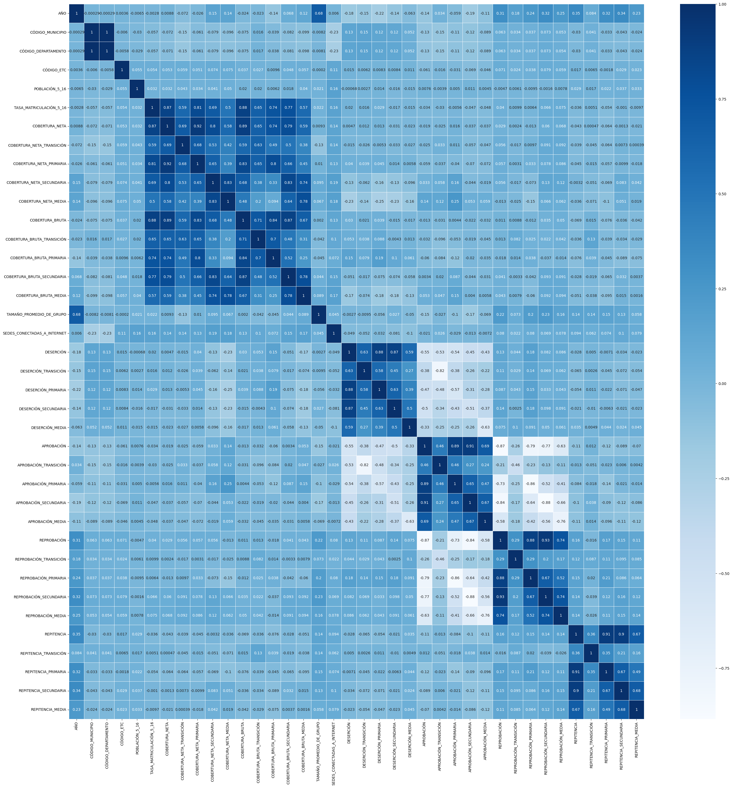
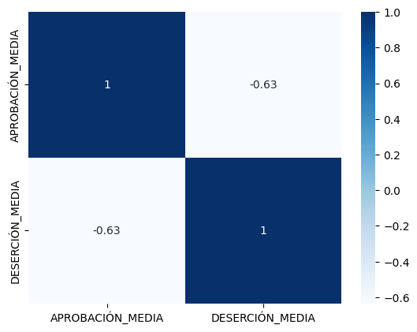
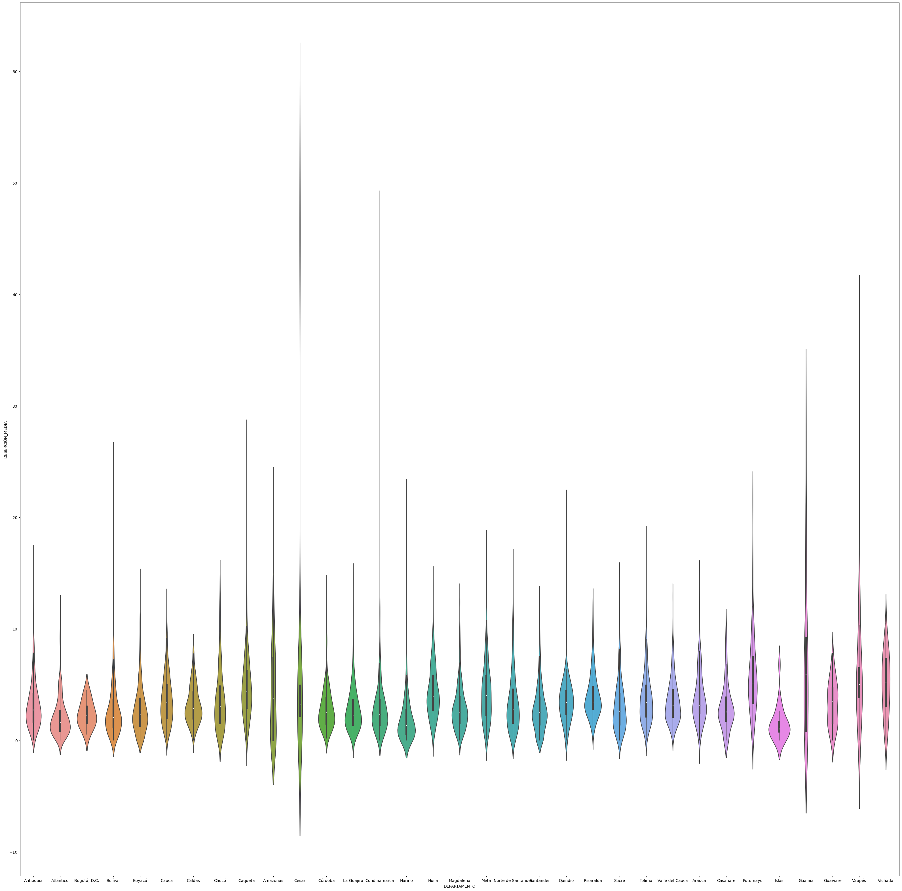
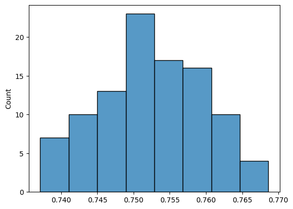
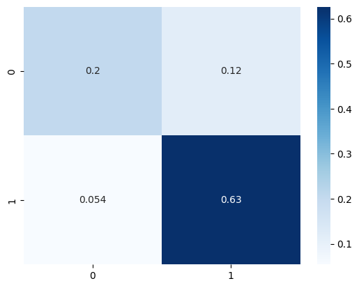

# **School dropout predictive model**

Using the database MEN ESTADÍSTICAS EN EDUCACIÓN EN PREESCOLAR, BÁSICA Y MEDIA POR MUNICIPIO provided by Datos abiertos, a predictive model to get the school dropout is built.

## **Database**

The selected database is MEN ESTADÍSTICAS EN EDUCACIÓN EN PREESCOLAR, BÁSICA Y MEDIA POR MUNICIPIO located in
the government website https://www.datos.gov.co/Educaci-n/MEN_ESTADISTICAS_EN_EDUCACION_EN_PREESCOLAR-B-SICA/nudc-7mev. The
mentioned database presents us with statistical information corresponding to the educational levels of preschool, basic and secondary by municipalities, with official information collected between the years 2011 and 2019 and preliminary data for the year
2020.

<table border="1" class="dataframe">
  <thead>
    <tr style="text-align: right;">
      <th></th>
      <th>AÑO</th>
      <th>CÓDIGO_MUNICIPIO</th>
      <th>MUNICIPIO</th>
      <th>CÓDIGO_DEPARTAMENTO</th>
      <th>DEPARTAMENTO</th>
      <th>CÓDIGO_ETC</th>
      <th>ETC</th>
      <th>POBLACIÓN_5_16</th>
      <th>TASA_MATRICULACIÓN_5_16</th>
      <th>COBERTURA_NETA</th>
      <th>...</th>
      <th>REPROBACIÓN</th>
      <th>REPROBACIÓN_TRANSICIÓN</th>
      <th>REPROBACIÓN_PRIMARIA</th>
      <th>REPROBACIÓN_SECUNDARIA</th>
      <th>REPROBACIÓN_MEDIA</th>
      <th>REPITENCIA</th>
      <th>REPITENCIA_TRANSICIÓN</th>
      <th>REPITENCIA_PRIMARIA</th>
      <th>REPITENCIA_SECUNDARIA</th>
      <th>REPITENCIA_MEDIA</th>
    </tr>
  </thead>
  <tbody>
    <tr>
      <th>0</th>
      <td>2011</td>
      <td>5001</td>
      <td>Medellín</td>
      <td>5</td>
      <td>Antioquia</td>
      <td>3759</td>
      <td>Medellín</td>
      <td>386466.0</td>
      <td>108.73</td>
      <td>108.5</td>
      <td>...</td>
      <td>0.03</td>
      <td>0.00</td>
      <td>0.00</td>
      <td>0.01</td>
      <td>0.17</td>
      <td>4.57</td>
      <td>0.15</td>
      <td>3.26</td>
      <td>7.44</td>
      <td>2.95</td>
    </tr>
    <tr>
      <th>1</th>
      <td>2011</td>
      <td>5002</td>
      <td>Abejorral</td>
      <td>5</td>
      <td>Antioquia</td>
      <td>3758</td>
      <td>Antioquia (ETC)</td>
      <td>4146.0</td>
      <td>97.81</td>
      <td>97.8</td>
      <td>...</td>
      <td>1.70</td>
      <td>0.00</td>
      <td>1.23</td>
      <td>2.96</td>
      <td>1.18</td>
      <td>0.89</td>
      <td>0.00</td>
      <td>0.85</td>
      <td>1.08</td>
      <td>1.23</td>
    </tr>
    <tr>
      <th>2</th>
      <td>2011</td>
      <td>5004</td>
      <td>Abriaquí</td>
      <td>5</td>
      <td>Antioquia</td>
      <td>3758</td>
      <td>Antioquia (ETC)</td>
      <td>483.0</td>
      <td>88.61</td>
      <td>88.6</td>
      <td>...</td>
      <td>7.29</td>
      <td>0.00</td>
      <td>1.47</td>
      <td>14.66</td>
      <td>7.46</td>
      <td>1.69</td>
      <td>3.13</td>
      <td>1.47</td>
      <td>2.22</td>
      <td>0.00</td>
    </tr>
    <tr>
      <th>3</th>
      <td>2011</td>
      <td>5021</td>
      <td>Alejandría</td>
      <td>5</td>
      <td>Antioquia</td>
      <td>3758</td>
      <td>Antioquia (ETC)</td>
      <td>702.0</td>
      <td>118.52</td>
      <td>118.5</td>
      <td>...</td>
      <td>3.58</td>
      <td>0.00</td>
      <td>2.16</td>
      <td>4.39</td>
      <td>8.04</td>
      <td>0.60</td>
      <td>0.00</td>
      <td>0.96</td>
      <td>0.00</td>
      <td>0.00</td>
    </tr>
    <tr>
      <th>4</th>
      <td>2011</td>
      <td>5030</td>
      <td>Amagá</td>
      <td>5</td>
      <td>Antioquia</td>
      <td>3758</td>
      <td>Antioquia (ETC)</td>
      <td>6631.0</td>
      <td>78.65</td>
      <td>78.7</td>
      <td>...</td>
      <td>8.99</td>
      <td>0.24</td>
      <td>6.73</td>
      <td>14.46</td>
      <td>7.45</td>
      <td>0.42</td>
      <td>0.00</td>
      <td>0.24</td>
      <td>0.91</td>
      <td>0.00</td>
    </tr>
  </tbody>
</table>

## **Graphic analysis**

### Pairplot
    

    

### Heatmap of correlations

#### All variables
    

    

#### Our variables of interest 
    

    
### Violin plot
    
   

## **Model**

The predictive model developed was limited to analyzing and predicting data referring to secondary education. More specifically, approval and the department in question are used to predict low or high school dropout in a certain municipality.

## **Results**

The model was trained and validated a thousand times, obtaining an average score of 75% and a variance of 4%.
    

    
## **Hypothesis**

**The most rural municipalities have a higher dropout rate.**

A study carried out by the United Nations in which the different provinces of the country are classified according to their rurality is taken as a basis.

### **Confusion matrix**
  

## **Conclusion**

Based on the rurality data provided by the United Nations compared with the dropout rate and the predictive model, the hypothesis can be approved.
